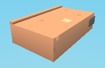
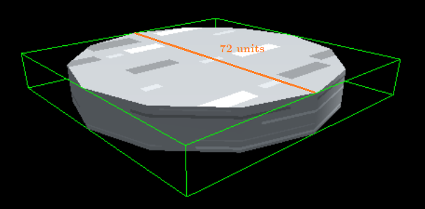

# Slide mapmaking guide

## Intro
This is a guide I wrote for myself. It describes things that I **personally** think a good slide map could consider.


## Process
1. Build each level in isolation. Your map can just consist of a spawn room with teleporters to each level, where each level is totally separate from the others and contains a teleporter that returns you to the spawn (see `slide_map_template.txt`). This stage of development will probably be the most time-consuming.
2. Playtest each level and rank them in terms of difficulty
3. Link the levels together - create the map itself. If you built all the levels facing in the same direction, you may want to rotate them at this stage to create an interesting layout.
4. Work on the aesthetics

The main point is that levels are first built in isolation. This gives you a lot of flexibility in comparison to designing all the levels in order. If you have an idea for an easy level, you can implement it straight away. If you want to make a hard level, you can also do that immediately. You don't have to commit yourself to a certain ordering of levels because all the arranging happens later.


## Sliding
These are the mechanics and skills you may want to exercise in your map.

### Slide techniques
- Long jump
- Slide hopping
- Slide strafing
- Slipping
- Ducking
- Air strafing
- Braking (speed control)
- Ramps
- Cylinders
- Driveby
- etc.

### Aspects of skill
- Consistency/stamina
- Ambidexterity (moving in a left or right direction)
- Precision
- etc.


## Level design
### Key principles
- **Innovation**: be creative, introduce something new
- **Dynamic movement**: feature exciting movements like high drops, long jumps and sharp turns
- **Consistent fun**: spread out the fun levels to keep players interested
- **Smooth difficulty curve**: sequence your map so that each level is just as hard or harder than the level before it
- **Fair warning**: if a level introduces a new concept, present that concept early. Don't end with something new, it feels gimmicky and frustrating.
- **Flow**
    - Clearly define where each level ends and where the next one begins
    - Make navigation between levels easy and unconfusing
    - Avoid secret points
    - Protect players from falling back into a previous level

### Common causes of cheese and some solutions
- Funky FPS interactions
    - Lower FPS => higher jumps
    - Lower FPS => faster air strafing
    - Higher FPS => longer jumps
    - Higher FPS players glitch on ramps more often, causing them to launch forwards extremely quickly. This is especially common when they're near the top of ramps.
- Ramps intersecting with other collidable objects creating speed glitches
    - Solution: don't intersect ramps with other collidable objects
- Collidable decor being used in unintended ways
    - Solution: be careful with collidable decor
- Jumping between platforms to build up speed and then launching through the level
    - Solution: vary the height of platforms so that players can't jump to previous ones
    - Solution: block the direction in which the player would launch themselves after building up speed
- Unintended jumping
    - Solution: add a low ceiling, although note that this still leaves the potential to perform headhitters
    - Solution: block the player with a teleporter that returns them to the start of the level
- Unintended slipping
    - Solution: add a lip to the platform

        

### Options for connecting levels
- Physically connecting levels (e.g. `slide_moonlight`):
    - Momentum can be maintained between levels, which is amazing for speedrunning
    - You can easily backtrack
- Linking with hold-down-mouse teleporters (e.g. `slide_daydream`):
    - Levels can be rearranged by simply changing teleport channel IDs, which is great for development
    - Changes to a level won't affect other levels, which is great for development
    - As opposed to linking with momentum-preserving teleporters, the player must be precise in their landing because the holding action requires them to be on the ending platform for some time
- Linking with momentum-preserving teleporters (unattempted):
    - Best of both worlds?

### Level table
A level table is a tool that I've used to keep track of level difficulties and the distribution of slide techniques.

First, list the slide techniques that your map will explore. For example:
- a. Slipping
- b. Ramps
- c. Ducking
- d. Air strafing
- e. Braking
- f. Driveby

Then create a table where the columns are the symbols corresponding to your chosen slide techniques and the rows are your levels. Order the levels/rows as they appear in your map. For example:

```c
slide_daydream zone A (red)
   a b c d e f
   x . x . x . gutter
   . . x . . . little weave
   x . . x . . tumble
   x x x . . x skid
   . . . . x . bridge
// . x . . x x backtrack
   x x . . . . ramp turn
   . . . . x . halt
   x . . . . . xylophone
   x x . . . x 180
```

A cell that's crossed out at row X column Y means that level X involves technique Y. For example, in the table above, the level called "backtrack" involves techniques b, e and f, which are ramps, braking and driveby. "Backtrack" is level 16 on `slide_daydream`:


The table above tells us that there's a nice distribution of slipping (a), ramps (b), braking (e) and driveby (f) in that set of levels, whereas ducking (c) is concentrated near the start and there's very little air strafing (d). I was satisfied with this spread, but if I wasn't, I could easily see where the problem was and what levels I could modify.

Use a table like this to order your levels by difficulty and visualise the distribution of slide techniques across your map.


## Aesthetics
- An object should look collidable if and only if it is collidable
    - If an object is obstructive as a result of this rule, delete it
    - This rule also applies to parts of objects; hitboxes should be completely clear
- Spice things up using cosmetic landmarks and significant changes in elevation and direction
- Create a "palette" of decorations or materials and then mix-and-match these to decorate each level. This creates a consistent theme.
- Give the player a lot of space unless you're deliberately trying not to. Make wide starting platforms and large rooms.
- Use fog wisely
- Raise the bar with custom assets


## Technical details
### Useful editor settings
- Speed 100, sprinting 1800
- Show real hitbox
- Object place near
- Anti radians
- Rotation snapping 45deg

### Maximums
- Objects:
    - 3500 for unverified users
    - 6000 for verified users
    - In any case, stick to 3500 as only verified players will be able to host maps with >3500 objects
- Signs: 35
- Map name length: 16 characters

### Noteworthy strange behaviours
- Rotating an object does not rotate its hitbox
- Undo/redo is broken, so avoid it and just reload a save instead
- In order for a block to be shot or destroyed, it needs to have health and a respawn time
- In order to teleport to an interface, it must be collidable, but it doesn't have to be visible

### Common values
- Players are about 12 units tall
- Crouching players are about 9 units tall
- A 60 FPS player can jump over a wall about 18 units high
- A 5 FPS player can jump over a wall about 20 units high
- The maximum length a player can jump on 60 FPS is about 72 units. Use a cylinder with a diameter of 72 units as a ruler to ensure your platforms are spaced far apart enough (if you need to ensure this).


### Implementation patterns
- For level N, allocate teleport channel N and interface IDs N0, N1, N2, ..., N9
    - This avoids ambiguity for yourself and any collaborators. For example, under this scheme, an object with interface id 110 is unambiguously the first interface on level 11 (11, 0) and not the eleventh interface on level 1 (1, 10).
- Stop momentum on receiving teleporters, not sending teleporters

### Reloading updated custom assets
1. Restart chrome
2. [Disable cache](https://www.technipages.com/google-chrome-how-to-completely-disable-cache)
3. Load map
